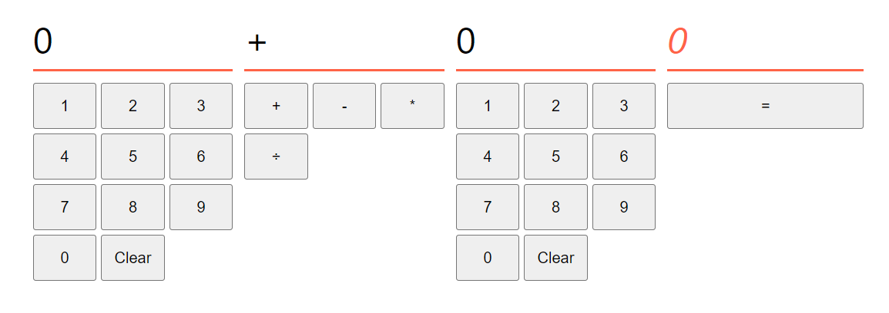

# React State Simple Calculator
In this exercise you build a simplified calculator application using React.

## Learning Objectives
- Build a component that uses a useState hook to keep component state.
- Build a component with an onClick attribute that has a value of the function to invoke when the event is triggered
- Model the data a React application needs and create state hooks accordingly.

## Set up
* Fork and clone this repository
* `npm ci` to install dependencies
* `npm run dev` to start the React development server

## Requirements
You are required to implement a simplified calculator app.

- When the user presses a numbered button on either of the panels, the display above should be updated to show that number. 🟢
- When user presses the clear button, the display should be set back to `0` 🟢
- When the user presses one of the operation buttons (`+`, `-`,`*`,`÷`) the operation display should be updated to show that operation. 🟢
- When the user presses the equals button the answer display should be updated to show the result of the calculation. 🟢

## Tips
- Start by modelling the state of the application
 - What state will you need to keep track of?
 - What user interactions will modify that state and how?
- Start with one or two functional buttons and only consider the add operation. When you have that working, make additional buttons functional.

## Extension 1
- Update your solution so the number panels act like a real calculator when inputting numbers
  - Numbers should *appended*, so pressing `1` then `2` should result in `12` being displayed 🟢
  - If the user presses a number while '0' is displayed, the number should *replace* '0' on the display. Subsequent numbers, including 0, are appended on to the display as usual. 🟢
  - If the user presses '0' while '0' is displayed, the display should remain at '0'. It should not be possible to define a number with leading zeros. 🟢

## Extension 2
- Add a "store" button underneath the answer.  🟢
- When this button is clicked, the current answer should be stored in a state variable.
- Add a "recall" button to each of the number displays. When this button is clicked, the currently stored value should be shown on the corresponding number panel.

## Extension 3
- Add a "." button to the numbers panel of each section 🟢
- When the user presses this button, a decimal separator should be added to the number 🟢
- Only a single separator can be added to each number
- If no digit appears after the separator, the calculator should consider the number as having no separator (i.e. "1." should be treated as "1"). 🟢
- Unlike whole numbers, leading zeros should be allowed after the separator. For example, "00001" is not valid, but "0.00001" is and "1.00001" is.  🟢
